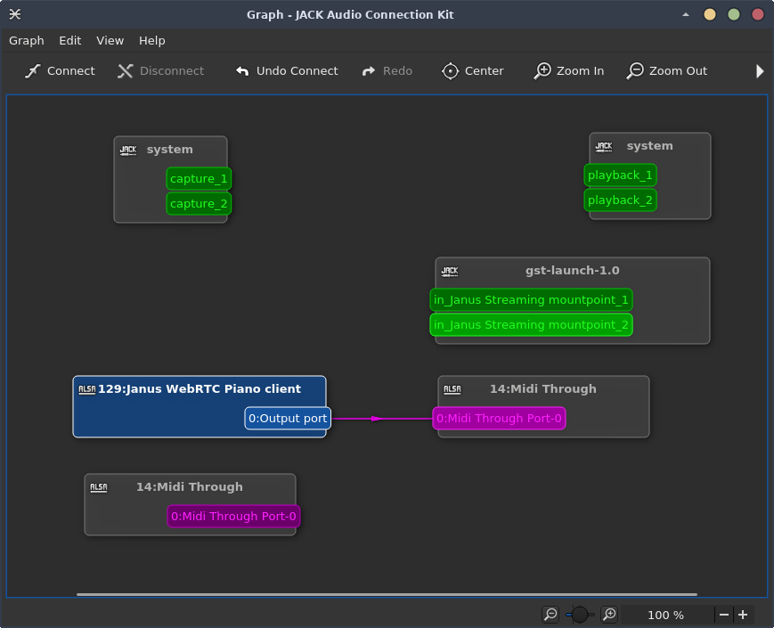
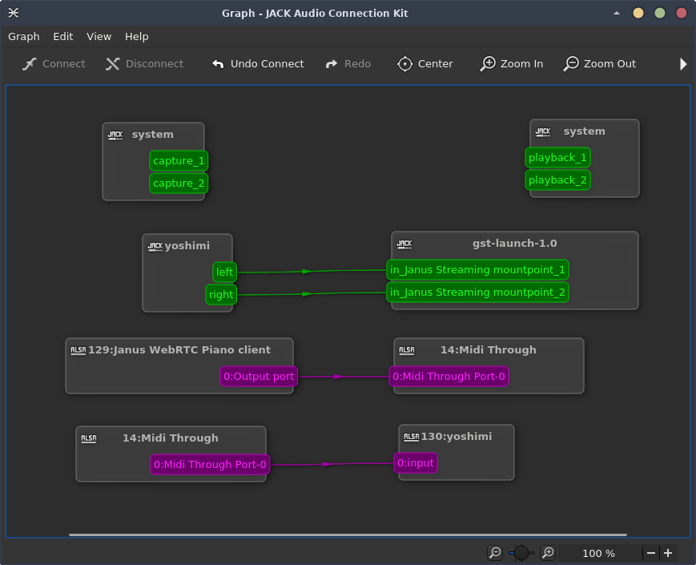
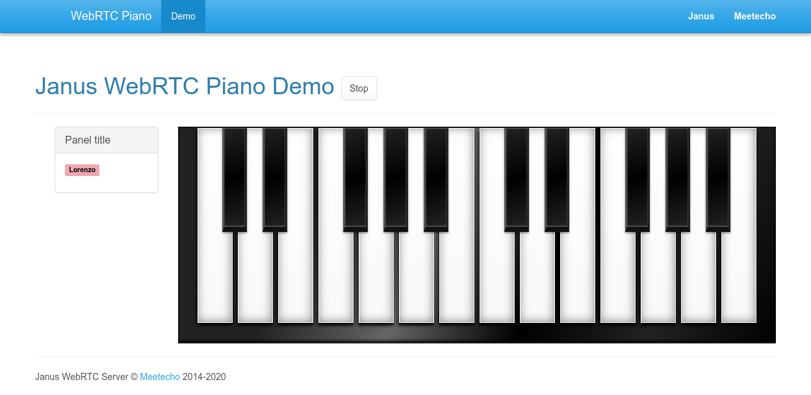

webrtc-piano
============

This is the code I originally wrote for the "Dangerous Demo" session at ClueCon '19 a few months ago.

The short demo (about 3 minutes) can be seen on [YouTube](https://youtu.be/8Hzg4hSJMsQ?t=790), and was basically an attempt to use WebRTC and Jack together for music purposes. More specifically:

* I used this cool CSS [piano keyboard](https://codepen.io/felipefialho/pen/oDEki) snippet by [Felipe Fialho](https://piano.felipefialho.com/) to allow multiple web participants to "play" the same keyboard.
* I then hooked the key hits to a data channel, connected to the [Janus WebRTC Server](https://github.com/meetecho/janus-gateway/).
* A Lua script in Janus translates the key hits to MIDI events, which are passed to "Midi Through" in Jack.
* A custom Gstreamer pipeline then listens for the output, encodes it to Opus, and sends it via RTP to a [Streaming mountpoint](https://janus.conf.meetecho.com/docs/streaming) in Janus.
* All web users connected to the demo subscribe to the mountpoint, and so can hear the output via WebRTC in real-time.

While of course not perfect, I thought this was a cool experiment, so I finally decided to update it and clean it up a bit, and share it here. Hopefully, it will help foster more usages of WebRTC for music-related purposes, which as I wrote in [this post](https://linuxmusicians.com/viewtopic.php?f=28&t=21617) is something I'd really love to see happening more. Feel free to do with it whatever you want!

## Requirements

The demo requires a working installation of Janus, and of the Lua plugin: please refer to the Janus README for instructions on how to install both properly. Besides, you'll need to install the [midialsa](https://www.pjb.com.au/comp/lua/midialsa.html) library for Lua, as the script provided in this repo makes use of it.

You'll also need an installation of gstreamer that supports [jackaudiosrc](https://gstreamer.freedesktop.org/data/doc/gstreamer/head/gst-plugins-good/html/gst-plugins-good-plugins-jackaudiosrc.html), besides Opus and RTP, since the script provided in this repo uses them all.

Of course, you'll need a working [Jack](https://jackaudio.org/) setup as well. How you'll configure that (e.g., what to use to render the MIDI data) will be up to you, and explained later.

## Configuring Janus

Besides the usual configuration, you'll need to do two things:

1. configure the Lua plugin to use the script provided here:
2. create a Streaming plugin mountpoint that can receive the stream encoded by the gstreamer pipeline in this repo.

The former is quite easy, and can be done by editing the `janus.plugin.lua.jcfg` configuration file, e.g.:

```
general: {
	path = "/opt/janus/share/janus/lua"
	script = "/home/lminiero/webrtc-piano/webrtc-piano.lua"
}
```

If everything's working, you should see something like this in the logs when you launch Janus:

```
Loading plugin 'libjanus_lua.so'...
[webrtc-piano.lua] Loading...
[webrtc-piano.lua] Loaded
[webrtc-piano.lua] Initialized
Janus Lua plugin initialized!
```

Creating the Streaming plugin mountpoint is quite straightforward too. All you need to do is creating an audio-only mountpoint that listens on the port the gstreamer pipeline is configured to send to: of course, feel free to choose a different port and update the gstreamer pipeline accordingly. This is a simple example you can add to the `janus.plugin.streaming.jcfg` configuration file:

```
webrtc-piano: {
	type = "rtp"
	id = "2019"
	audio = true
	audioport = 20190
	audiopt = 111
	audiortpmap = "opus/48000/2"
	secret = "adminpwd"
}
```

If everything's working, when you start the gstreamer script (`gst-jack-janus.sh`) you should see something like this in the Janus logs:

```
[webrtc-piano] New audio stream! (ssrc=1980195523)
```

which means Janus is correctly receiving data from it.

## Playing with Jack

After you start Janus and launch the gstreamer script, your Jack graph should look something like this:



As you can see in the screenshot above, the gstreamer pipeline should be ready to receive incoming audio via Jack, while the Lua script in Janus (which registers as "Janus WebRTC Piano client") should automatically connect to the MIDI through node via ALSA. I chose to have it connected there to make it easier to switch instruments dynamically, but you're of course free to edit the Lua script to implement a different behaviour, or change the connections to your liking after the fact.

After that, it should be straightforward to figure out the next steps: all you need to do is launch whatever you want to be able to receive the MIDI input and render it to audio, and connect things accordingly. In the screenshot below, I used a yoshimi instance for the purpose, but it should work with anything else.



I simply connected the MIDI through node to Yoshimi (so that it will receive the notes played by the web user), and then connected the output of yoshimi itself to the gstreamer pipeline (which means that whaterver yoshimi plays will encoded and sent in real-time to Janus, and from there to users). At this point, the demo should be ready to be tested.

## Using the demo

To try the demo, you need to serve the contents of the `web` folder with a web server. Notice that, while locally (localhost) it's not needed, you may have to serve the page via HTTPS if the user is on a different machine: in that case, make sure you follow the [deployment guidelines](https://janus.conf.meetecho.com/docs/deploy) for Janus, to serve the Janus API and the pages through the same server (e.g., via nginx); notice you'll need to update the `server` variable in `index.js` accordingly, in case.

**IMPORTANT:** browsers currently don't support Jack, which means that if you launch the demo on the same machine Janus and Jack are started on, you will NOT hear the output coming via WebRTC through the browser. You'll need a browser launched on a separate machine for this.

That said, using the demo should be quite straightforward. After opening the page, you should be prompted for a name, which will be how you'll be seen in the demo: a random color is picked for you as well, and the same will happen for other users joining the session.



Playing on the keyboard should result in the audio (in my case rendered by yoshimi) through your browser. When you hit a key, the event is relayed to all the other users in the session as well: this means that, if another participant plays a note, you'll see the related key changing color to the one associated to the participant, and so will them when it's you playing. Good chances this is very buggy (I didn't test it much), but for demo purposes this is more than enough.

Hope you'll enjoy this little toy! Please feel free to join the [Janus community](https://groups.google.com/forum/#!forum/meetecho-janus) in case you have trouble installing Janus or getting it to run as you want to play with this.
